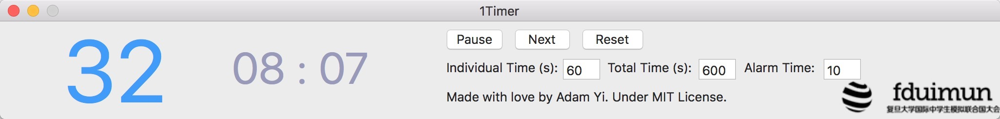

1Timer
------
A simple MUN Timer for Mac OS. It offers two timers inside, one for individual timing while the other for whole timing. It is designed by Adam Yi, first used for FDUIMUN2016 IIF.

### Usage

Set the individual time (seconds), total time (seconds). Click "Reset". Then click "Start" to start timing, click "Next" for another speaker. When the time left for one individual equals to the alarm time set, it will play an alarm sound to remind the delegate to finish his or her speech in a short period of time. Set the alarm time to "-1" to disable the alarming function.

Although this usage introduction is not so clear, the software is so easy to use that you will figure out how it works even without this tutorial and begin to fall in love with it.

To customize the logo or the sounds, please change the resource file and recompile it using Xcode. If you are okay with the current logo and sounds, feel free to use the [pre-compiled releases](https://github.com/adamyi/1Timer/releases).

### License

[MIT](LICENSE)
