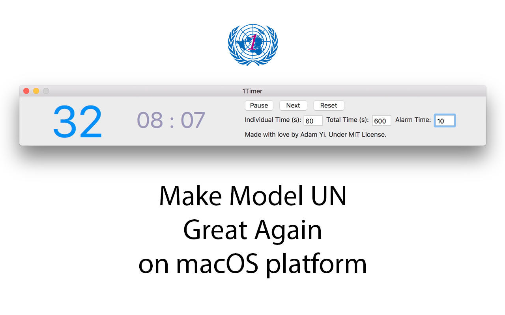

1Timer
------
A simple MUN Timer for macOS. It offers two timers inside, one for individual timing while the other for whole timing. It is designed by Adam Yi, first used for FDUIMUN2016 IIF.

### Usage

Set the individual time (seconds), total time (seconds). Click "Reset". Then click "Start" to start timing, click "Next" for another speaker. When the time left for one individual equals to the alarm time set, it will play an alarm sound to remind the delegate to finish his or her speech in a short period of time. Set the alarm time to "-1" to disable the alarming function.

To begin with, visit the [App Store](https://itunes.apple.com/cn/app/1timer/id1273511199?l=en&mt=12) to download the newest release. The software is so easy to use that you will figure out how it works even without this tutorial and begin to fall in love with it.

If you do feel the need to add your conference logo to the GUI of the app, or change the default sounds, feel free to download the source code and recompile it. You are more than welcomed to submit pull requests to this repo as well.

### License

[MIT](LICENSE)
